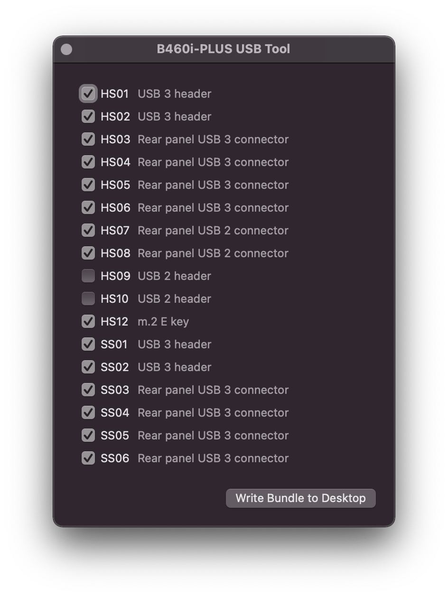

# usbtool.command



<details><summary><strong>What's this?</strong></summary>

A graphical property list editor, `usbtool.command` exposes only a hard-coded list of the 17 USB ports available on B460i-PLUS. The generated `USBPorts.kext` is intended to be used in combination with `SSDT-USBX`, `SSDT-xh_cmvd4` and `config.plist` in this repository. Creating a dummy `EC` device is not required with recent versions of macOS.

- OpenCore adds a compatible device ID for the 200 series host controller
- OpenCore replaces `SSDT-xh_cmvd4` with a working table
- `IOUSBHostFamily` class `AppleUSBHostResources` resource-matches on `IORTC`
- `AppleUSBHostResources` handles the host controller power-related device properties in `SSDT-USBX`
- `USBPorts.kext` matches on device `XHC` to provide a mapping of 15 or fewer ports

<br>

</details>

After completing the OpenCore `config.plist` according to [README.md](/README.md) and installing macOS, the following procedure will generate a valid `USBPorts.kext`

#### Run usbtool.command

- boot the B460i-PLUS system into macOS
- run `usbtool.command` found in the root directory of this repository
- keep within the 15 port limit by switching off at least 2 ports
- press the button to generate `USBPorts.kext` on the desktop

#### Replace USBPorts.kext in the OpenCore Kexts Directory

- mount the EFI system partition
- replace `USBPorts.kext` in `/Volumes/EFI/EFI/OC/Kexts` with the version from the desktop

## Port Locations

<details><summary><strong>USB 2</strong></summary><br>

| Port | Location                   |
|:-----|:---------------------------|
| HS01 | USB 3 header               |
| HS02 | USB 3 header               |
| HS03 | Rear panel USB 3 connector |
| HS04 | Rear panel USB 3 connector |
| HS05 | Rear panel USB 3 connector |
| HS06 | Rear panel USB 3 connector |
| HS07 | Rear panel USB 2 connector |
| HS08 | Rear panel USB 2 connector |
| HS09 | USB 2 header               |
| HS10 | USB 2 header               |
| HS12 | m.2 E key                  |

<br></details>

<details><summary><strong>USB 3</strong></summary><br>

| Port | Location                   |
|:-----|:---------------------------|
| SS01 | USB 3 header               |
| SS02 | USB 3 header               |
| SS03 | Rear panel USB 3 connector |
| SS04 | Rear panel USB 3 connector |
| SS05 | Rear panel USB 3 connector |
| SS06 | Rear panel USB 3 connector |

<br></details>

## Sunrise Point

Note that this B460 board wants AppleUSBXHCIPCI loading with class AppleUSBXHCISPT, otherwise USB will not work. PCI device ID injection in the OC config.plist:

```xml
...
<key>DeviceProperties</key>
<dict>
    <key>Add</key>
    <dict>
        ...
        <!-- 200 series USB controller: add supported device ID -->
        <key>PciRoot(0x0)/Pci(0x14,0x0)</key>
        <dict>
             <key>device-id</key>
             <data>r6IAAA==</data>
         </dict>
        ...
    </dict>
</dict>
...

```
